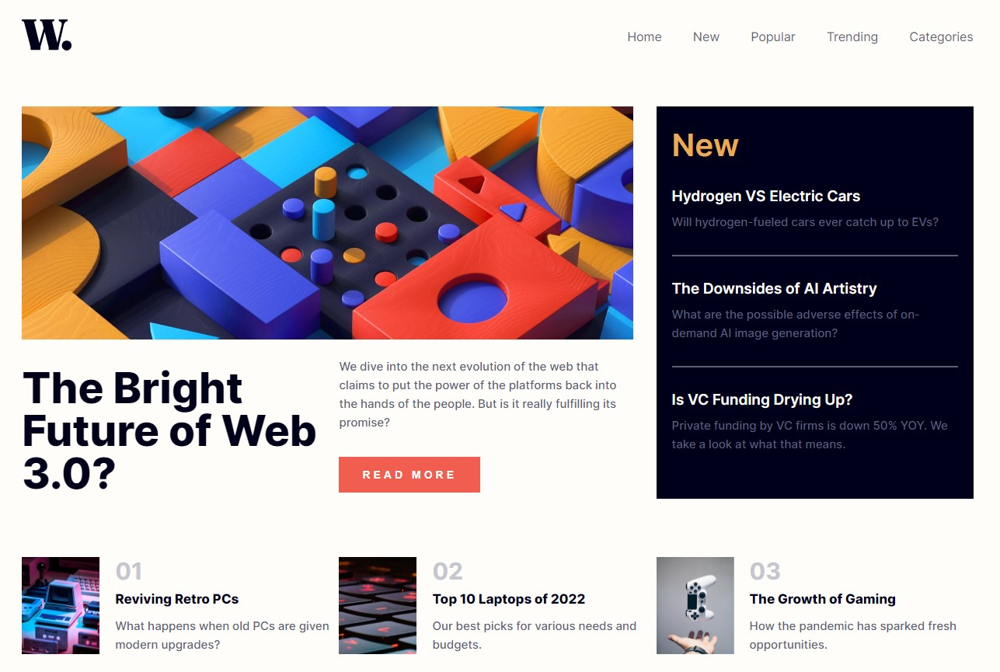
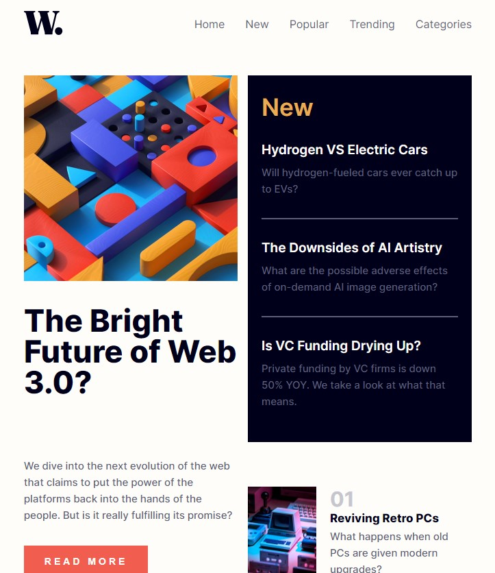

# Frontend Mentor - News homepage solution

This is a solution to the [News homepage challenge on Frontend Mentor](https://www.frontendmentor.io/challenges/news-homepage-H6SWTa1MFl). Frontend Mentor challenges help you improve your coding skills by building realistic projects.

## Table of contents

- [Overview](#overview)
  - [The challenge](#the-challenge)
  - [Screenshot](#screenshot)
  - [Links](#links)
- [My process](#my-process)
  - [Built with](#built-with)
  - [Useful resources](#useful-resources)
- [Author](#author)

## Overview

### The challenge

Users should be able to:

- View the optimal layout for the interface depending on their device's screen size,
- See hover and focus states for all interactive elements on the page.

### Screenshot

### Links

- Solution URL: https://github.com/mateusz-przybyla/News-homepage
- Live Site URL: https://mateusz-przybyla.github.io/News-homepage/

## My process

### Built with

- Semantic HTML5 markup
- BEM methodology
- SASS (Syntactically Awesome Style Sheets)
- Flexbox
- Grid
- Mobile-first workflow
- Vanilla JavaScript
- DOM Manipulation

### Useful resources

- [Web Development Bootcamp](https://www.udemy.com/course/the-complete-web-development-bootcamp/?couponCode=KEEPLEARNING) - The Web Development Bootcamp in which I am taking part.
- [MDN Web Docs](https://developer.mozilla.org/en-US/) - My best website which help me understand rules and features about HTML, CSS and JavaScript languages.
- [Sass Basics](https://sass-lang.com/guide/)
- [Metodyka CSS - BEM](https://www.nafrontendzie.pl/metodyki-css-2-bem)
- [Mobile Navigation Bar](https://www.w3schools.com/howto/howto_js_mobile_navbar.asp)

## Author

- Frontend Mentor - [@mateusz-przybyla](https://www.frontendmentor.io/profile/mateusz-przybyla)
